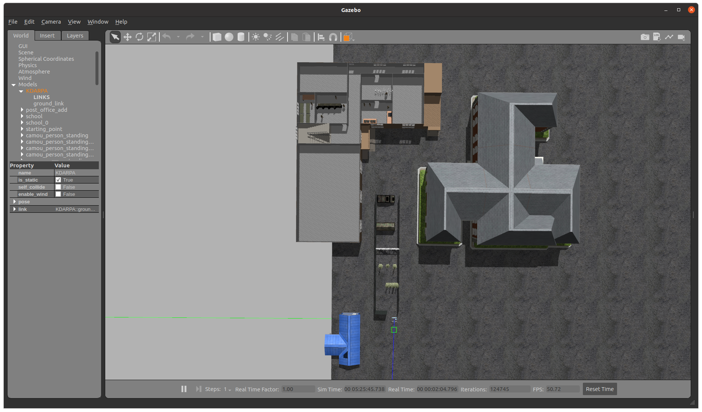
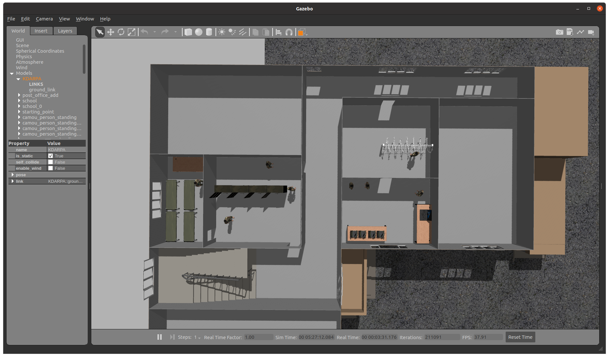
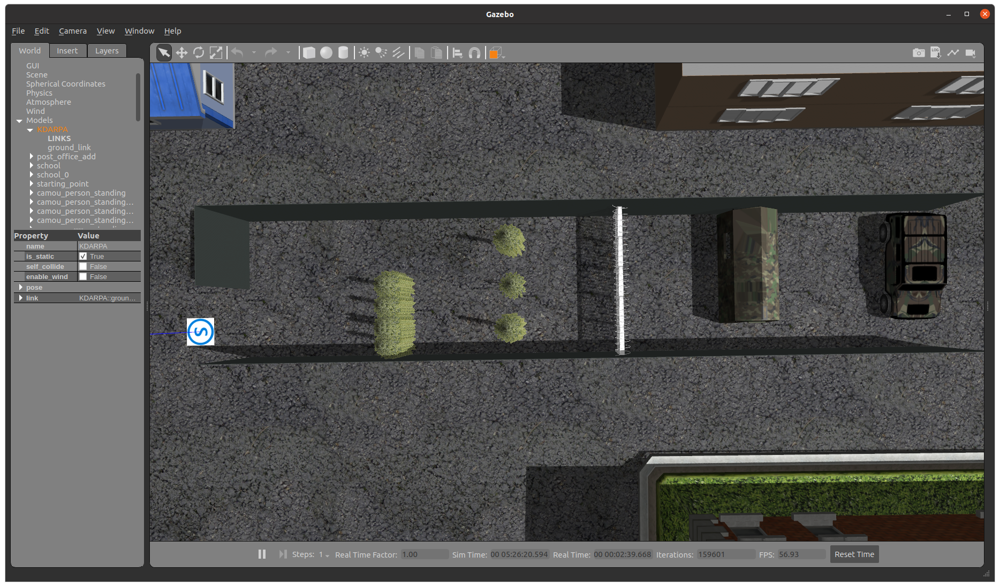

# KDARPA_world
-----
## Content
 Gazebo map of "2022 ADD Drone competition". Target building is "Daejeon Drone&Robot Support Center". The building has drawn by Solidworks and converted by the [SW2URDF plugin](http://wiki.ros.org/sw_urdf_exporter).    
 </img></img></img></img>   
 Using the CAD file in this map is not permitted. Please contact to the author of this CAD file.   

## HOW TO USE
1. Clone this repository at your ROS workspace.
2. Build the package
3. Use the [install.sh](/install.sh) to setup GAZEBO environment.
4. Type the below terminal command to check out [final version of gazebo map](/launch/gazebo.launch)
  ```bash
  $ roslaunch kdarpa_world gazebo.launch
  ```

## Caution
 Launch file included in this package is not the final version. This is the viewer of the URDF file of the building only.
 
 
 ## MEMO
 ### SW2URDF plugin 사용 방법
 * 꽤 잘 정리된 링크: [**YOUTUBE link**](https://www.youtube.com/watch?v=OSL-zqw4cXs&t=285s)   
 * 설치할 때도 Solidworks 버젼에 [적합한 버젼](https://github.com/ros/solidworks_urdf_exporter/tags)를 잘골라서 설치해야함.   
 * 주의사항은 **Global Origin**을 잘잡아야함.
 ### SW2URDF plugin 적용 팁
  SW2URDF plugin을 사용해 출력된 패키지를 활용하면 RVIZ에서는 urdf의 material을 참조할 수 있지만, GAZEBO simulator에서는 인식이 되지 않음.   
  아마 GAZEBO는 sdf 형식의 파일을 기본으로 사용하기 때문에 urdf 형식의 파일을 sdf 형식으로 변환하는 과정 중에 문제가 발생하는 것으로 보임.   
  이 문제를 해결하기 위하여 상위 디렉토리에 [**media/materials**](/media/materials), [**media/materials/scripts**](/media/materials/scripts) 디렉토리를 생성하고 plugin에서 자동적으로 생성해준 textures 디렉토리를 media/textures에 soft linking 해줌으로써 URDF을 생성할 당시 지정하였던 텍스쳐 정보를 활용함.   
  구체적인 방법으로는 scripts에서 textures의 파일을 기반으로 하는 material들을 정의([example](/media/materials/scripts/paint.material))해주고 이를 URDF에 gazebo 요소([example](/urdf/KDARPA.urdf#L1969))로 추가함으로써 해결함.   
